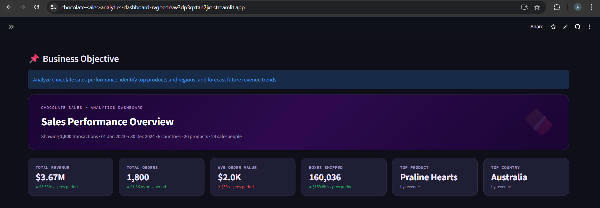
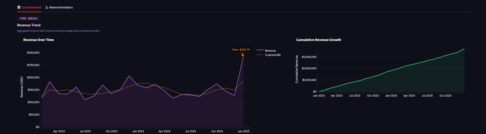
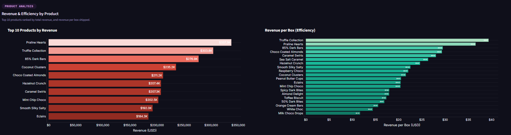
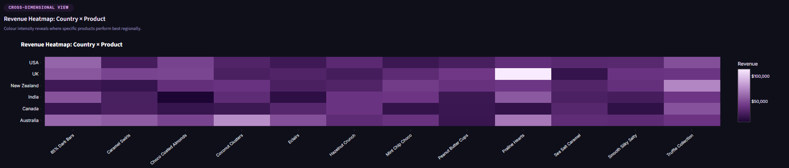
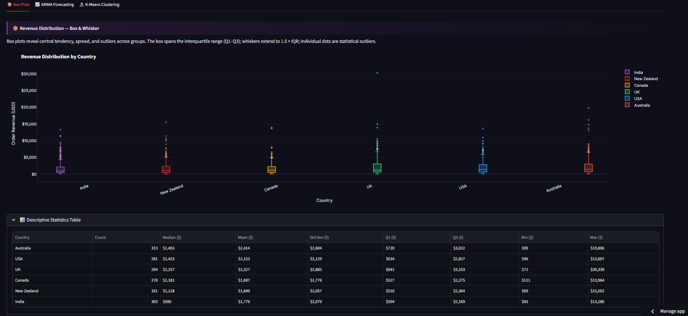
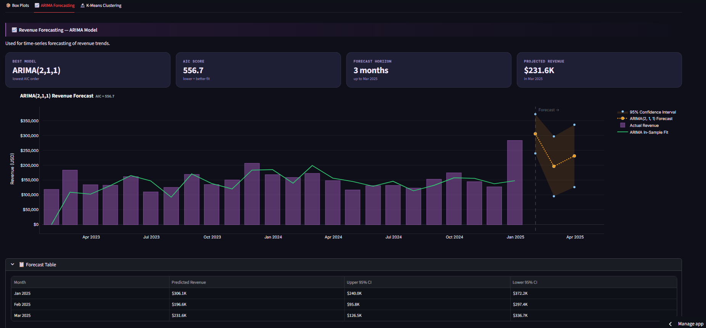
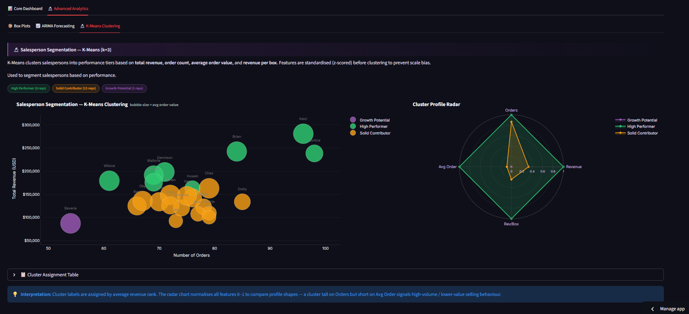

# 🍫 Chocolate Sales Analytics Dashboard

## 🚀 Live Demo

👉 https://chocolate-sales-analytics-dashboard-rvgbedcvw3dp3qxtan2jxt.streamlit.app/

---

## 🌟 Why This Project Stands Out

* End-to-end **data analytics + machine learning pipeline**
* Built for **real-world business decision-making**
* Combines **interactive dashboards + predictive analytics**
* Fully deployed and production-ready using Streamlit

---

## 📌 Project Overview

This project is an **interactive business intelligence dashboard** designed to analyze chocolate sales data and generate actionable insights.

It transforms raw transactional data into:

* 📊 Interactive visual analytics
* 📈 Time-series forecasting
* 🧠 Data-driven business recommendations

The goal is not just visualization, but enabling **data-backed decision-making**.

---

## 🎯 Business Problem

Businesses often struggle to answer:

* 📈 How are sales trending over time?
* 🌍 Which regions generate the most revenue?
* 🏆 Which products drive performance?
* 👥 How effective is the sales team?
* 🔮 What will future demand look like?

This dashboard solves these using **analytics + machine learning**.

---

## 📊 Key Features

### 🔹 Interactive Dashboard

* Dynamic filters (Country, Product, Time)
* Real-time KPI updates
* Drill-down exploration

### 🔹 KPI Metrics

* Total Revenue
* Total Orders
* Average Order Value
* Top Performing Product

### 🔹 Advanced Visualizations

* Revenue trends with moving averages
* Country-wise performance analysis
* Product-level insights
* Heatmaps (Country × Product)
* Salesperson performance (bubble chart)

---

## 🧠 Machine Learning & Analytics

### 📈 Time-Series Forecasting

* Model: **ARIMA**
* Predicts future revenue trends
* Helps in demand planning and strategy

**Why ARIMA?**

* Suitable for time-series data
* Captures trend and seasonality
* Performs well on limited datasets

---

### 👥 Customer / Sales Segmentation

* Model: **K-Means Clustering**
* Segments salespersons based on performance
* Identifies high vs low performers

---

### 📊 Statistical Analysis

* Distribution insights using box plots
* Outlier detection for sales patterns

---

## 📏 Model Evaluation

To ensure reliability:

* **ARIMA**

  * RMSE (Root Mean Squared Error)
  * MAE (Mean Absolute Error)

* **K-Means**

  * Inertia
  * Silhouette Score

---

## 📌 Key Insights Generated

* 🌍 Top revenue-generating countries identified
* 🏆 Best-selling products highlighted
* 📈 Seasonal trends and peak sales periods detected
* 👥 Salesperson performance differences analyzed
* 🔮 Future revenue trends forecasted

---

## 💡 Business Recommendations

* Focus marketing efforts on **high-performing regions**
* Promote **top-selling products** to maximize revenue
* Improve training for **low-performing sales clusters**
* Use forecasting to **optimize inventory & supply chain**

---

## 🛠 Tech Stack

| Layer            | Tools Used     |
| ---------------- | -------------- |
| Language         | Python         |
| Dashboard        | Streamlit      |
| Data Processing  | Pandas, NumPy  |
| Visualization    | Plotly         |
| Machine Learning | ARIMA, K-Means |

---

## 🏗 Project Structure

```bash
Chocolate-Sales-Analytics-Dashboard/
│
├── app.py
├── data/
├── Images/
│   ├── Box_Plots.png
│   ├── Forecasting.png
│   ├── Heatmap.png
│   ├── K-Means_Clustering.png
│   ├── Main.png
│   ├── Product_Analysis.png
│   ├── Revenue_Trend.png
│
├── src/
│   ├── data_loader.py
│   ├── preprocessing.py
│   ├── visualization.py
│   ├── utils.py
│
├── requirements.txt
└── README.md
```

✔ Modular and organized structure for scalability and clarity


✔ Modular architecture for scalability and maintainability

---

## ⚙️ How to Run Locally

```bash
git clone https://github.com/anvitac7/Chocolate-Sales-Analytics-Dashboard
cd Chocolate-Sales-Analytics-Dashboard

pip install -r requirements.txt
streamlit run app.py
```

---

## 📷 Dashboard Preview

### 🏠 Main Dashboard



### 📈 Sales Trends & Forecasting





### 🌍 Regional Insights



### 🧠 Advanced Analytics







---

## ⚡ Performance Optimization

* Streamlit caching (`@st.cache_data`) for faster execution
* Efficient data preprocessing pipeline
* Modular design for easy updates

---

## 📈 Scalability Considerations

* Can be extended to real-time dashboards using APIs
* Modular structure allows easy model upgrades
* Suitable for cloud deployment (Streamlit Cloud, AWS, etc.)

---

## 🚀 Future Improvements

* Customer segmentation using RFM analysis
* Anomaly detection for sales spikes/drops
* Model comparison (ARIMA vs Prophet/LSTM)
* Enhanced UI/UX with animations

---

## 👩‍💻 Author

**Anvita Choudhary**
AI & Data Science
KJ Somaiya School of Engineering

---

## ⭐ Support

If you found this project useful:

👉 Give it a **⭐ on GitHub** — it really helps!
